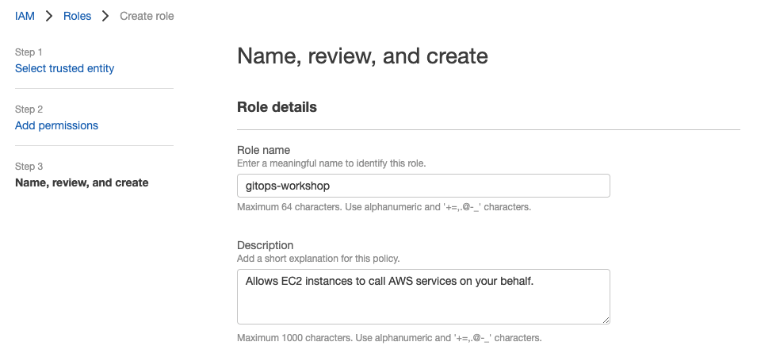
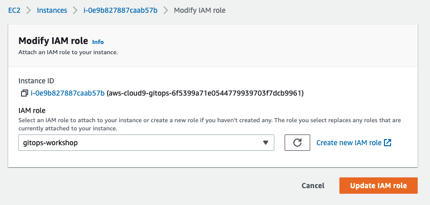

# The initial setup
## Prerequisites

Each cluster you create requires 1 VPC (with an Internet Gateway attached), 2
Public Subnets, 2 Private Subnets, 2 NAT Gateways, and 2 Elastic IP Addresses
(attached to the NAT Gateways). Please make sure that the quotas of the AWS
account you use for deploying this sample implementation can accommodate that.

This document will assume all resources are created in `eu-west-1`.

## Create and prepare the Cloud9 workspace


1. Navigate to the [Cloud9 console](https://console.aws.amazon.com/cloud9/).

2. Create a new Cloud9 environment with the name "gitops", using an EC2 *t2.micro* instance and *Ubuntu 18.04* platform. Leave all other settings as default, and select **Create Environment**.

3. While the Cloud9 environment is being created, create an EC2 IAM role for your workspace instance as follows:
    1. Open another tab to access the [IAM console](https://console.aws.amazon.com/iam/).
    2. From the menu bar on the left, choose **Roles**.
    3. Choose **Create Role**.
    4. For **Trusted entity type** choose **AWS Service**, and then choose the use case **EC2**. Choose **Next**
    5. On the **Add Permissions** screen, add the *AdministratorAccess* policy, and then choose **Next**. 
    6. Give the role a name, for example "gitops-workshop", and choose **Create role**. .

4. Attach this IAM role to your Cloud9 EC2 instance as follows:

    1. Switch to the tab running your Cloud9 IDE.

    2. If it has still not finished being created, then wait until creation is complete.
    3. Click the grey circle button (in top right corner) and choose  **Manage EC2 Instance**.  
    4. This opens the EC2 console in a separate tab, with a filter applied to show the EC2 instance for your Cloud9 IDE. Select the instance, then choose **Actions / Security / Modify IAM Role**. 
    5. On the **Modify IAM role** screen, choose *gitops-workshop* from the IAM role dropdown. 
    6. Choose **Update IAM role**.
    7. Close the tab and return to your Cloud9 IDE tab.

5. In a Cloud9 Terminal window, upgrade to the latest AWS CLI using:
   ```
   curl "https://awscli.amazonaws.com/awscli-exe-linux-x86_64.zip" -o "awscliv2.zip"
   unzip awscliv2.zip
   sudo ./aws/install
   ```

6. Disable Cloud9 managed credentials using:
   ```
   aws cloud9 update-environment  --environment-id $C9_PID --managed-credentials-action DISABLE
   rm -vf ${HOME}/.aws/credentials
   ```

7. Verify that Cloud9 is using the *gitops-workshop* IAM role you created.
   ```
   aws sts get-caller-identity --query Arn | grep gitops-workshop -q && echo "IAM role valid" || echo "IAM role NOT valid"
   ```

8. Increase the volume of the EBS volume to 30GB as follows.
    1. Copy the [volume resize script from the Cloud9 documentation](https://docs.aws.amazon.com/cloud9/latest/user-guide/move-environment.html#move-environment-resize) into a file `resize.sh` in your Cloud9 environment.
    2. Run 
       ```
       bash resize.sh 30
       ```


## Install tools

Having set up your Cloud9 environment, you can now install a number of tools that will be used to build the multi-cluster GitOps environment.

1. Install Kubernetes CLI (`kubectl`)
   ```bash
   sudo curl --silent --location -o /usr/local/bin/kubectl \
      https://amazon-eks.s3.us-west-2.amazonaws.com/1.19.6/2021-01-05/bin/linux/amd64/kubectl

   sudo chmod +x /usr/local/bin/kubectl
   ```

2. Install Flux CLI
   ```bash
   curl -s https://fluxcd.io/install.sh | sudo bash
   ```

3. Install `kubeseal`
   ```bash
   wget https://github.com/bitnami-labs/sealed-secrets/releases/download/v0.16.0/kubeseal-linux-amd64 -O kubeseal
   sudo install -m 755 kubeseal /usr/local/bin/kubeseal
   ```

4. Install the Github CLI
   ```bash
   curl -fsSL https://cli.github.com/packages/githubcli-archive-keyring.gpg | sudo dd of=/usr/share/keyrings/githubcli-archive-keyring.gpg
   echo "deb [arch=$(dpkg --print-architecture) signed-by=/usr/share/keyrings/githubcli-archive-keyring.gpg] https://cli.github.com/packages stable main" | sudo tee /etc/apt/sources.list.d/github-cli.list > /dev/null
   sudo apt update
   sudo apt install gh
   ```

5. Install `yq`
   ```bash
   sudo curl --silent --location -o /usr/local/bin/yq https://github.com/mikefarah/yq/releases/download/v4.24.5/yq_linux_amd64
   sudo chmod +x /usr/local/bin/yq
   ```

6. Install `eksctl`
   ```bash
   curl --silent --location "https://github.com/weaveworks/eksctl/releases/latest/download/eksctl_$(uname -s)_amd64.tar.gz" | tar xz -C /tmp
   sudo mv /tmp/eksctl /usr/local/bin
   ```
   
## Create a secret in AWS Secret Manager for Sealed Secrets keys

**Note:** Make sure you're using the same region as defined in multi-cluster-gitops/initial-setup/config/mgmt-cluster-eksctl.yaml

1. Generate a 4096-bit RSA key pair using *openssl*:
   ```bash
   cd ~/environment
   openssl genrsa -out sealed-secrets-keypair.pem 4096
   openssl req -new -x509 -key sealed-secrets-keypair.pem -out sealed-secrets-keypair-public.pem -days 3650
   ```
   Enter appropriate values (or accept defaults) for the various fields. 
2. Create a JSON document that contains the certificate and the private key as follows:
   ```
   CRT=$(cat sealed-secrets-keypair-public.pem)
   KEY=$(cat sealed-secrets-keypair.pem)
   cat <<EoF >secret.json
   {
     "crt": "$CRT",
     "key": "$KEY"
   }
   EoF
   ```
3. Store this JSON document as a `sealed-secrets` secret in the AWS Secrets Manager:
   ```
   aws secretsmanager create-secret \
     --name sealed-secrets \
     --secret-string file://secret.json
   ```

## Create AWS credentials for Crossplane

1. Create the IAM user that will be used by Crossplane for provisioning AWS resources (DynamoDB table, SQS queue, etc.)
   ```
   aws iam create-user --user-name crossplane
   ```

2. Create a programmatic access key for this user:
   ```
   ACCESS_KEY=$(aws iam create-access-key --user-name crossplane)
   echo $ACCESS_KEY
   ```
   Keep a record of the generated access key ID and secret access key as you will use them in a subsequent step.

3. Attach `AdministratorAccess` permissions policy to this user:
   ```
   aws iam attach-user-policy --user-name crossplane --policy-arn arn:aws:iam::aws:policy/AdministratorAccess
   ```
   **Note:** You can fine-tune the permissions granted to the created IAM user, and only select those that you want to grant to Crossplane.
   
### Create a `SealedSecret` for Crossplane AWS Credentials

1. Extract the access key credentials for the *crossplane* user you created in the previous section:
   ```
   ACCESS_KEY_ID=$(echo $ACCESS_KEY | yq e ".AccessKey.AccessKeyId")
   SECRET_ACCESS_KEY=$(echo $ACCESS_KEY | yq e ".AccessKey.SecretAccessKey")
   ```

2. Use these credentials to create a file `aws-credentials.conf` as follows:
   ```
   cd ~/environment
   echo -e "[default]\naws_access_key_id = $ACCESS_KEY_ID\naws_secret_access_key = $SECRET_ACCESS_KEY" > aws-credentials.conf
   ```

3. Create a Kubernetes `Secret` resource that contains the AWS credentials, and create a
   corresponding `SealedSecret` resource.
   ```
   kubectl create secret generic aws-credentials \
     -n crossplane-system \
     --dry-run=client --from-file=credentials=./aws-credentials.conf \
     -o yaml \
     >creds-secret.yaml
   kubeseal --cert sealed-secrets-keypair-public.pem --format yaml \
     <creds-secret.yaml >creds-sealedsecret.yaml
   ```
4. Replace the content of
   `gitops-system/tools/crossplane/crossplane-aws-provider-config/aws-credentials-sealed.yaml`
   with the content of `creds-sealedsecret.yaml`.
   ```
   cp creds-sealedsecret.yaml gitops-system/tools/crossplane/crossplane-aws-provider-config/aws-credentials-sealed.yaml
   ```

**Note:** Make sure you do not commit `aws-credentials.conf` and/or
`creds-secret.yaml` to Git. Otherwise, your AWS credentials will be stored
unencrypted in Git!

## Install the management cluster
1. Log into the AWS CLI with AWS credentials that have the privilege to create
   and connect to an EKS cluster

2. Create the management cluster using `eksctl`
```bash
eksctl create cluster -f ~/environment/multi-cluster-gitops/initial-setup/config/mgmt-cluster-eksctl.yaml
```

## Setup instructions to initialize git repositories

[Using GitHub as `GitRepository` backend.](doc/repos/GitHub.md#create-and-prepare-the-git-repositories)

OR

[Using AWS CodeCommit as `GitRepository` backend.](doc/repos/AWSCodeCommit.md#create-and-prepare-the-git-repositories)

## Connect to cluster
1. Connect to `<cluster-name>`  cluster using `kubeconfig` stored as a `Secret`
```bash
unset KUBECONFIG
kubectl -n flux-system get secret <cluster-name>-eks-connection -n flux-system -o jsonpath="{.data.value}" | base64 -d > wl-kube.conf
export KUBECONFIG=wl-kube.conf

kubectl config current-context
```
(Replace `<cluster-name>` with the cluster name).

## Monitoring Flux Kustomizations
* If you want to monitor the bootstrapping of the management cluster, and/or the
  provisioning/bootstrapping of the workload clusters, list the `Kustomization`
  resources in the management cluster using the following command:

```bash
kubectl get kustomization -n flux-system
```
* If you want to monitor the bootstrapping of the workload clusters, and the
  deployment of the applications into it, connect to the workload cluster by
  following the instructions above, then list the `Kustomization` resources
  using the following command:

```bash
kubectl get kustomization -n flux-system
```

NOTE: We will soon add a section about Flux notification controller, and how you
can use that to know the status of the reconciliation activities without having
to connect to the clusters.
