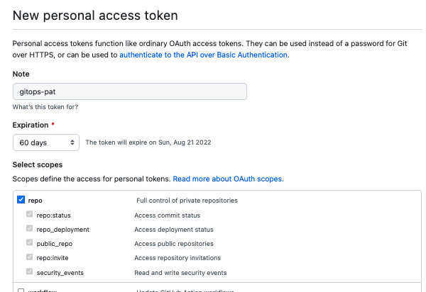

## Bootstrap the management cluster (using GitHub repos)

1. Create a GitHub personal access token. Using the GitHub console, navigate to **Settings->Developer Settings->Personal Access Tokens**.
   Use the **Generate new token** button to create a new token, selecting the `repo` scopes (these are
   the only ones required for the token used by Flux).

   

2. Bootstrap Flux on the management cluster with the `mgmt` cluster config path.
   ```bash
   export CLUSTER_NAME=mgmt
   export GITHUB_TOKEN=XXXX
   export GITHUB_USER=<your-github-username>

   flux bootstrap github \
   --components-extra=image-reflector-controller,image-automation-controller \
   --owner=$GITHUB_USER \
   --namespace=flux-system \
   --repository=gitops-system \
   --branch=main \
   --path=clusters/$CLUSTER_NAME \
   --personal
   ```

3. Wait for the `staging` cluster to start. Track the progress of the Flux
   deployments using the Flux CLI. This may take >30 minutes due to exponential
   backoff, however this is only a one-time process.
   ```bash
   flux get all
   ```
   You can watch this to see once it's ready by using:
   ```bash
   watch -n 30 -d flux get all
   ```


Once done, continue to follow setup instructions [here](../../README.md#connect-to-cluster).
